

# Il mio progetto finale in Laravel

In questo sito ci sono una parte backoffice e una frontoffice.

In quella backoffice è possibile registrarsi e accedere al proprio profilo per gestire il profilo stesso e i videogiochi, e una frontoffice per consultare il sito come ospite.

## Backoffice
Dopo la registrazione o il login è possibile visualizzare, creare, modificare ed eliminare giochi, generi e piattaforme.

- pagine di visualizzazione di tutti i giochi, i generi e le piattaforme. Da queste pagine puoi accedere alle pagine di modifica o eliminare le risorse:

    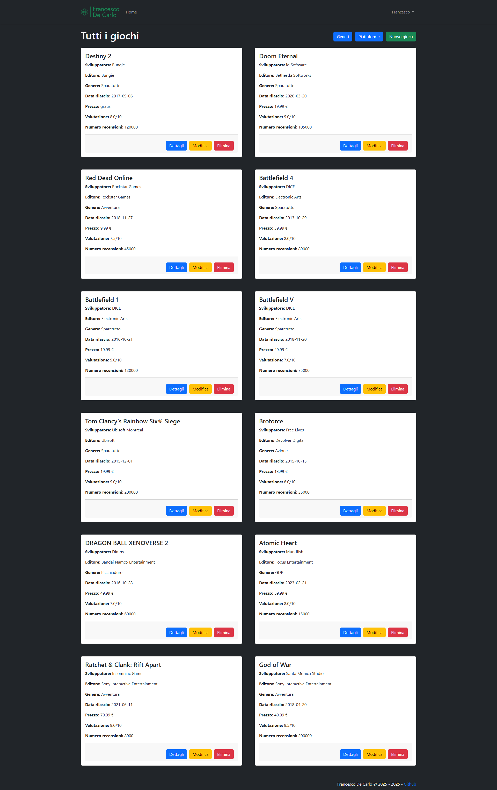
    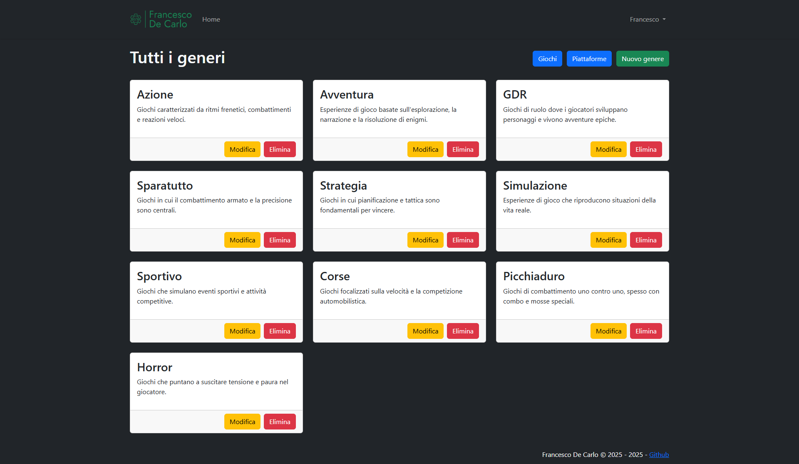
    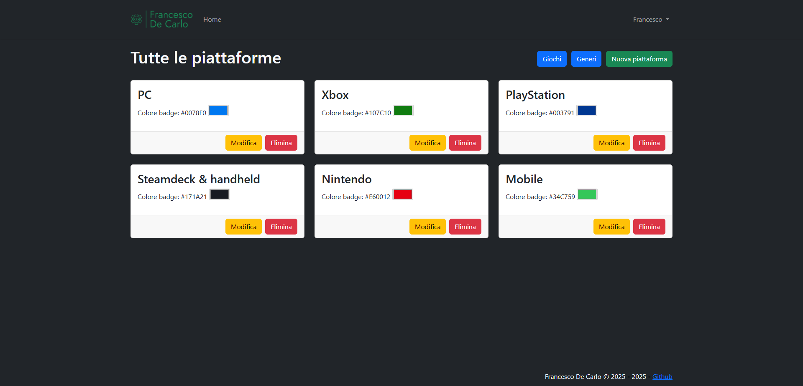

- per i giochi inoltre c'è la pagina di dettaglio:

    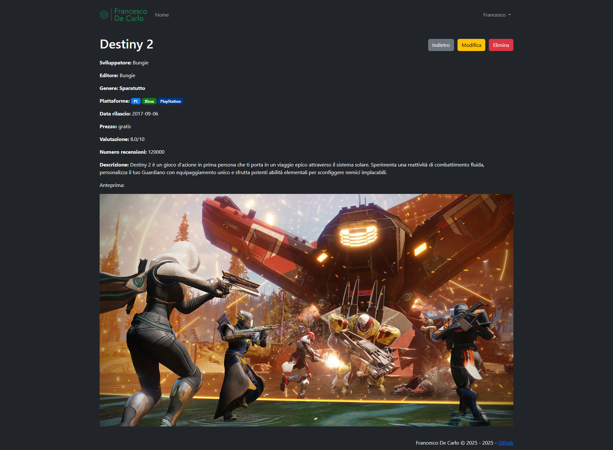

- pagine di creazione nuovi giochi, generi e piattaforme:

    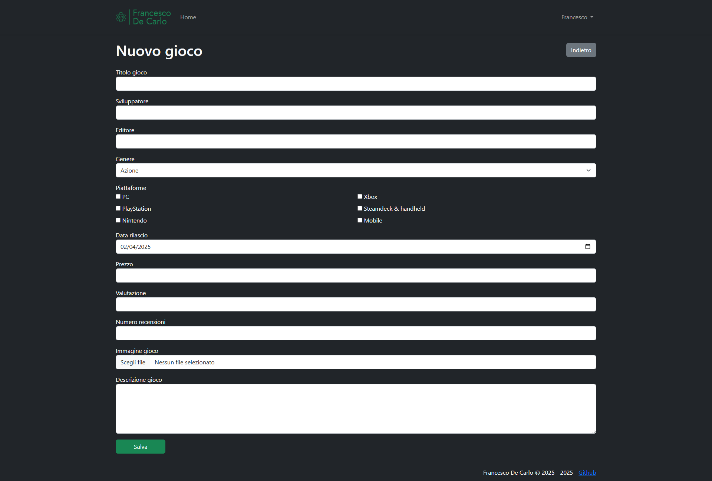
    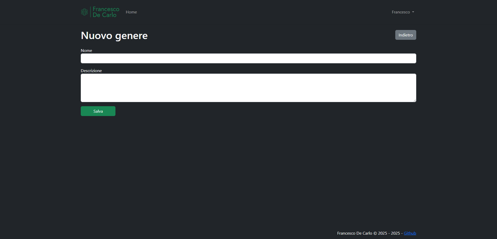
    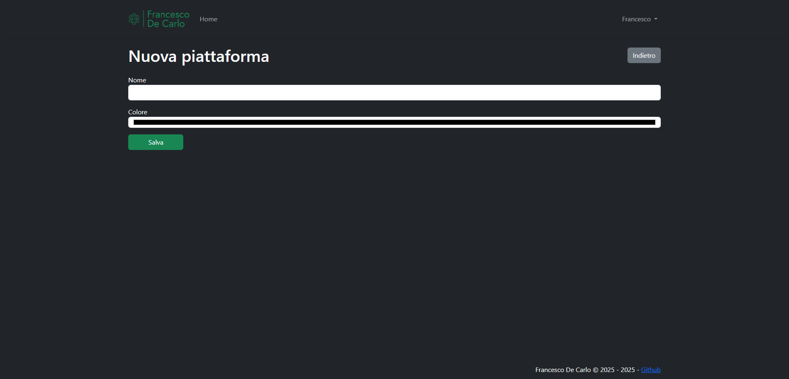

- pagine di modifica dei giochi, generi e piattaforme:

    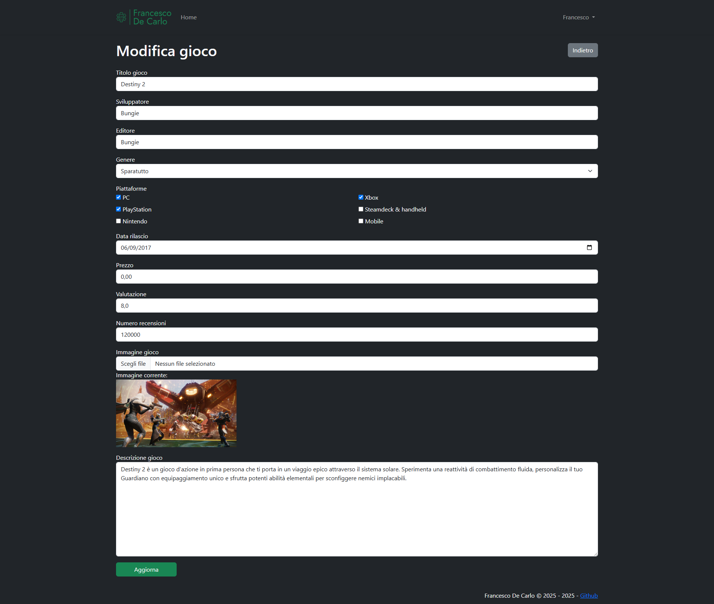
    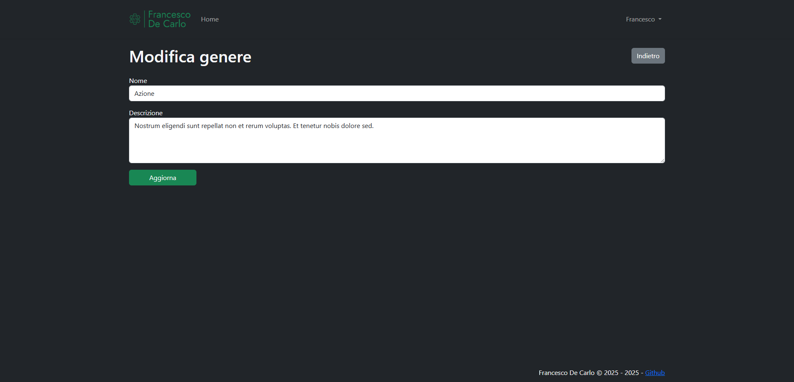
    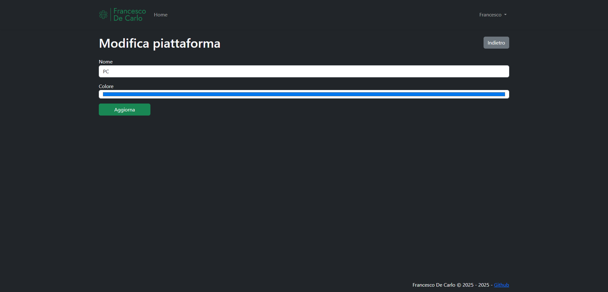

## Frontoffice
Consultabile senza bisogno di registrarsi. Qui è possibile solo visualizzare i giochi e i dettagli di ciascun gioco:

- pagina di visualizzazione di tutti i giochi:

    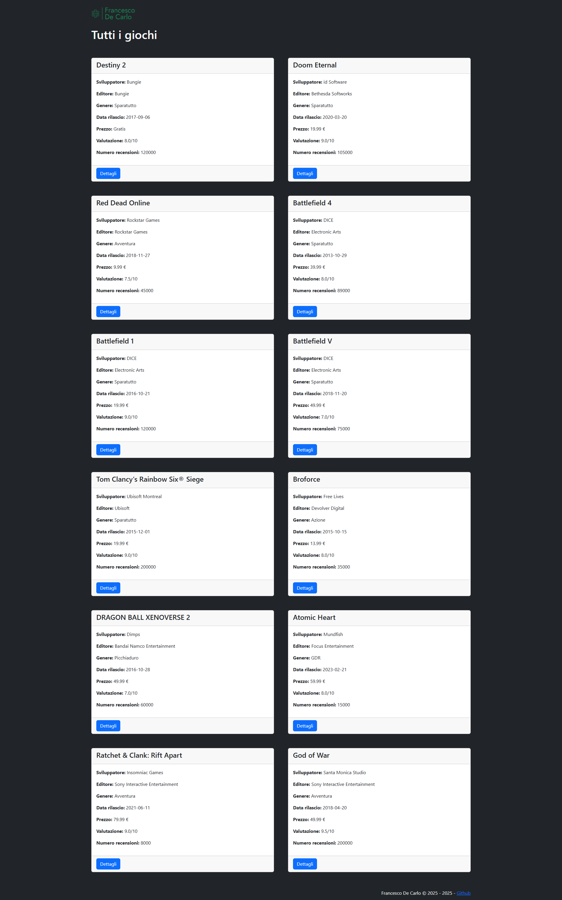

- pagina di dettaglio del singolo gioco:

    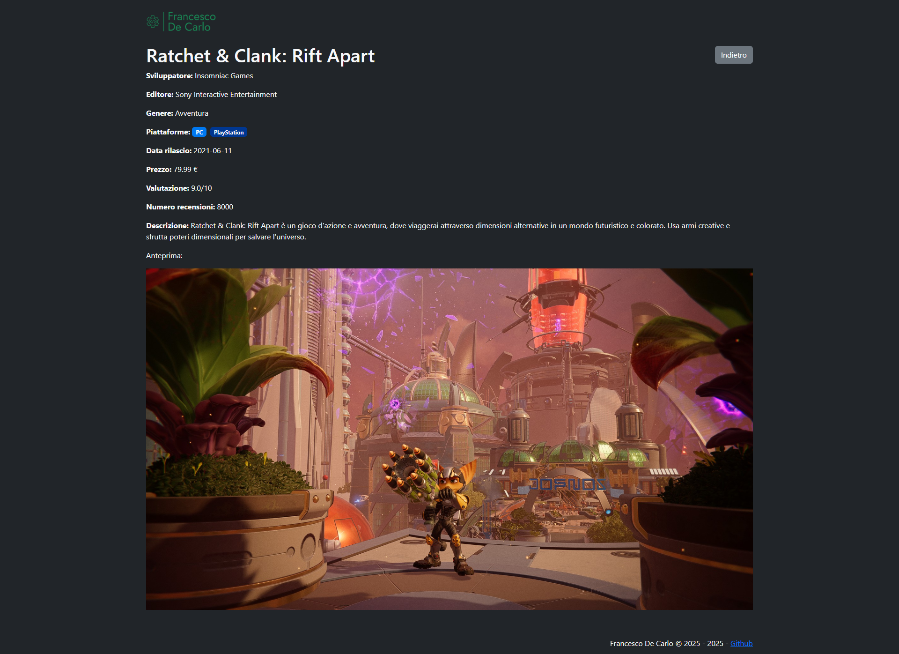

