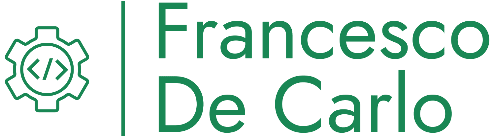

# Il mio progetto finale in Laravel

In questo sito ci sono una parte backoffice e una frontoffice.

In quella backoffice è possibile registrarsi e accedere al proprio profilo per gestire il profilo stesso e i videogiochi, e una frontoffice per consultare il sito come ospite.

